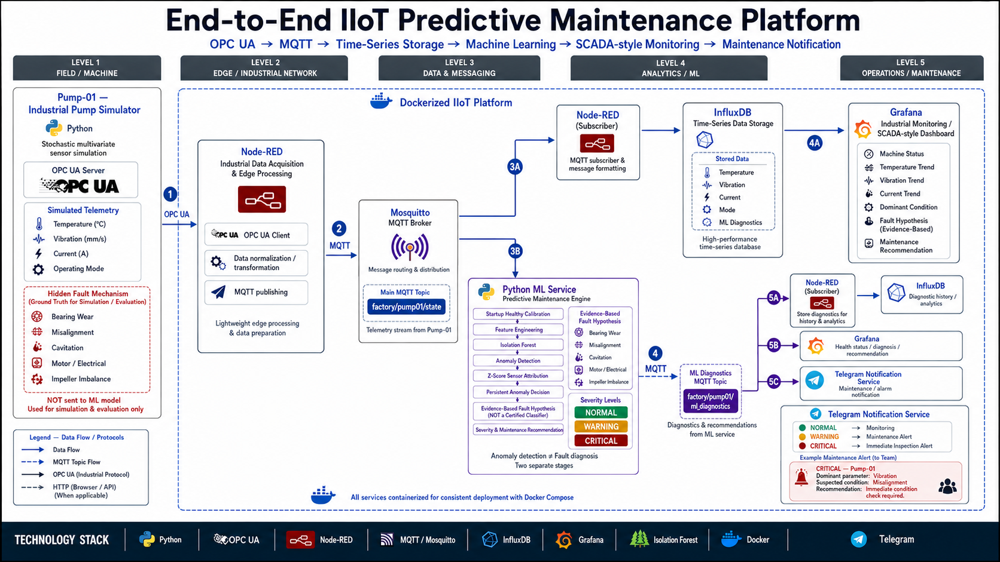
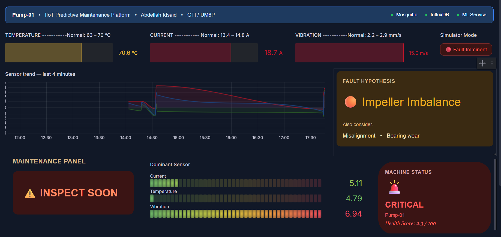
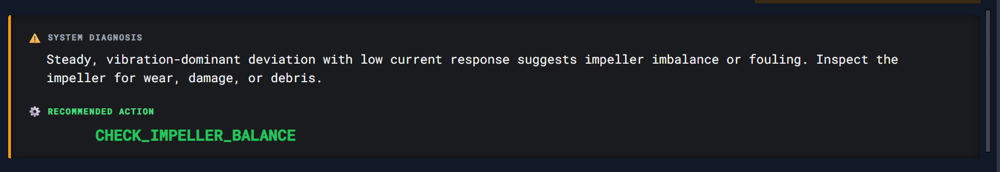
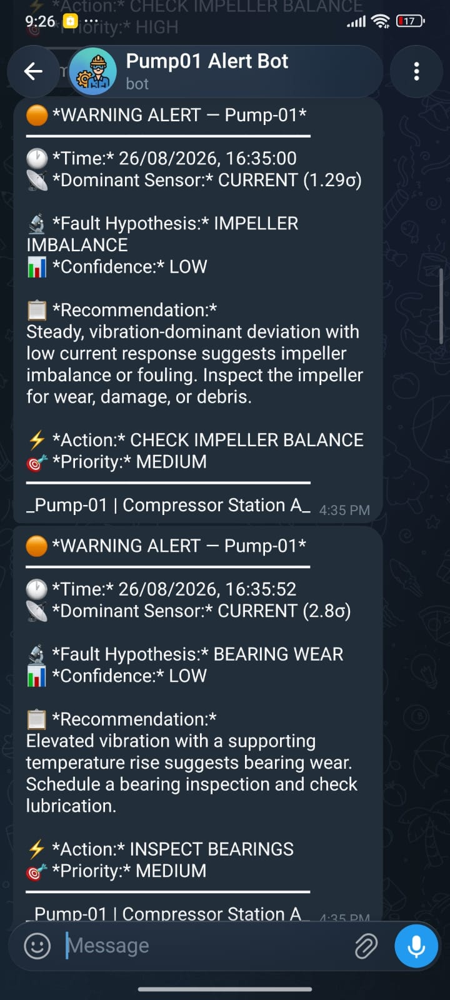

# IIoT Predictive Maintenance Platform

**End-to-end Industrial IoT condition monitoring system for rotating equipment**  from OPC UA data acquisition to real-time ML anomaly detection, fault diagnosis, and automated maintenance alerts.

Built as an industry-oriented portfolio project demonstrating a production-style Industry 4.0 architecture on a fully containerized local deployment.

---

## Overview

Industrial pumps and rotating machinery fail unexpectedly, causing costly unplanned downtime. This platform continuously monitors a simulated industrial pump (Pump-01), detects early signs of degradation using machine learning, identifies the probable fault mechanism, and alerts the maintenance team before failure occurs.

The system follows a production-style IIoT architecture using OPC UA for industrial data acquisition, MQTT for data distribution, time-series storage, real-time dashboards, and automated maintenance notifications.

---

## Architecture

```
┌──────────────────────────────────────────────────────────────────────┐
│                         FIELD / EDGE LAYER                           │
│                                                                      │
│   Python Pump Simulator  ──►  OPC UA Server (asyncua, port 4840)    │
│   (5 fault profiles,          Exposes: Temperature, Vibration,       │
│    stochastic behavior,       Current, Mode via standard OPC UA      │
│    4-min degradation cycle)   address space                          │
└─────────────────────────────┬────────────────────────────────────────┘
                              │ opc.tcp://simulator:4840
                              ▼
┌─────────────────────────────────────────────────────────────────────┐
│                        GATEWAY / EDGE LAYER                          │
│                                                                      │
│   Node-RED                                                           │
│   ├─ OPC UA Client  ──► reads sensor values every second            │
│   ├─ Protocol bridge: OPC UA → MQTT                                 │
│   ├─ Alarm logic & preprocessing                                     │
│   └─ Publishes to: factory/pump01/state                             │
└─────────────────────────────┬───────────────────────────────────────┘
                              │ MQTT (Mosquitto, port 1883)
                              ▼
┌──────────────────┐    ┌─────────────────────────────────────────────┐
│   MQTT Broker    │    │              SUBSCRIBERS                     │
│   Mosquitto      │───►│                                              │
│                  │    │  ┌─────────────────────────────────────┐    │
│  Topic:          │    │  │  ML Service (Python)                │    │
│  factory/pump01/ │    │  │  ├─ Phase 1: Online calibration     │    │
│  state           │    │  │  │   (IsolationForest, 100 samples) │    │
│                  │    │  │  ├─ Phase 2: Anomaly detection       │    │
│  factory/pump01/ │    │  │  ├─ Phase 3: Fault diagnosis        │    │
│  ml_diagnostics  │    │  │  │   (physics-informed scoring)     │    │
│                  │    │  │  └─ Publishes: severity, hypothesis, │    │
│                  │    │  │              recommendation          │    │
│                  │    │  └─────────────────────────────────────┘    │
│                  │    │                                              │
│                  │    │  ┌─────────────────────────────────────┐    │
│                  │    │  │  Node-RED → InfluxDB Writer         │    │
│                  │    │  │  Stores: sensor data + ML output    │    │
│                  │    │  └─────────────────────────────────────┘    │
│                  │    │                                              │
│                  │    │  ┌─────────────────────────────────────┐    │
│                  │    │  │  Telegram Bot API                   │    │
│                  │    │  │  Fires on: WARNING / CRITICAL       │    │
│                  │    │  └─────────────────────────────────────┘    │
└──────────────────┘    └─────────────────────────────────────────────┘
                                        │
                                        ▼ InfluxDB (port 8086)
┌─────────────────────────────────────────────────────────────────────┐
│   Grafana Dashboard (port 3000)                                      │
│   ├─ Sensor time series: Temperature, Vibration, Current            │
│   ├─ Machine Status panel: NORMAL / WARNING / CRITICAL              │
│   ├─ Dominant Sensor bar gauge (Z-score deviation)                  │
│   ├─ Fault Hypothesis: bearing_wear, misalignment, cavitation...    │
│   └─ Maintenance Recommendation with priority and action code       │
└─────────────────────────────────────────────────────────────────────┘
```
## Dashboard



---

## Tech Stack

| Layer | Technology | Purpose |
|---|---|---|
| Device simulation | Python 3.11, asyncua | Industrial pump simulator with OPC UA server |
| Field protocol | OPC UA (IEC 62541) | Standard industrial device communication |
| Edge gateway | Node-RED 5.0.4 | Protocol bridging, preprocessing, alarm logic |
| Message broker | Eclipse Mosquitto 2.0 | MQTT pub/sub backbone |
| ML service | Python, scikit-learn | Online anomaly detection + fault diagnosis |
| Time-series DB | InfluxDB 2.7 | Sensor and diagnostic data storage |
| Visualization | Grafana 10.4 | SCADA-style live dashboards |
| Notifications | Telegram Bot API | Maintenance team alerts |
| Containerization | Docker + Docker Compose | Full-stack single-command deployment |

---

## ML Pipeline

The ML service implements a two-stage online pipeline => no pre-trained model files, no offline dataset required.

**Stage 1 => Anomaly Detection (IsolationForest, unsupervised)**

The service self-calibrates during the first 100 readings of normal operation(this requires launching the ml_service first then the simulator ), fitting an IsolationForest model in memory. After calibration, every incoming reading is scored against the learned normal operating envelope. Output: continuous anomaly score.

No fault labels are needed. The model learns what "normal" looks like and flags deviations.

**Stage 2 => Fault Diagnosis (physics-informed signature matching)**

Once an anomaly is confirmed, the service analyzes which sensors deviated and how. Using engineering-informed sensor signatures consistent with condition-monitoring and fault-diagnosis principles. The approach is conceptually aligned with condition-monitoring and fault-diagnosis practices described in ISO 13373-1 and ISO 13379-1. Each fault hypothesis receives a continuous support score:

| Fault | Key signature |
|---|---|
| Bearing wear | Vibration dominant + moderate temperature rise |
| Misalignment | Vibration + elevated current together |
| Cavitation | High vibration variability + impulsive spikes |
| Motor / Electrical | Current dominant + temperature rise |
| Impeller imbalance | Vibration dominant, isolated |

Output includes most likely fault, confidence level (HIGH/MEDIUM/LOW), two alternatives, and a specific maintenance recommendation.

**Important note:** This is a proof-of-concept demonstrating the pipeline architecture. Diagnosis uses physics-based scoring, not a trained classifier. In a production deployment, the simulator would be replaced with real sensors and frequency-domain features would be added for precise bearing defect identification.

---

## Fault Simulator

The Python simulator generates realistic stochastic sensor data with temporal correlation (AR1 process), simulating a 4-minute degradation cycle:

- **0–120s:** Normal operation => stable readings with realistic noise
- **120–200s:** Progressive degradation => gradual drift with increasing variability
- **200–240s:** Fault imminent => severe anomalies, high deviation
- **Stops:** Does not auto-restart => simulates maintenance intervention

Each run randomly selects a fault profile from 5 options. The ML service never receives the fault label, it must infer the fault type from sensor patterns alone.

---

## Quick Start

**Requirements:** Docker Desktop, Git

```bash
# Clone the repository
git clone https://github.com/idsabdo/IIoT-Predictive-Maintenance-Platform
cd IIoT-Predictive-Maintenance-Platform

# Copy environment file and configure credentials
cp .env.example .env
# Edit .env with your InfluxDB credentials and Telegram bot token

# Start all services
docker compose up -d

# Check all 6 containers are running
docker compose ps

# Restart the simulator to begin a new simulation cycle
docker restart simulator
```

**Access the interfaces:**

| Service | URL | Default credentials |
|---|---|---|
| Grafana | http://localhost:3000 | See your .env file |
| InfluxDB | http://localhost:8086 | See your .env file |
| Node-RED | http://localhost:1880 | No auth |

**Watch the ML service calibrate:**
```bash
docker logs ml_service --follow
```

**Restart a simulation cycle after it completes:**
```bash
docker restart simulator
```

---

## Project Structure

```
IIoT-Predictive-Maintenance-Platform/
│
├── simulator/                    # Industrial pump simulator + OPC UA server
│   ├── simulator.py              # Pump physics, fault profiles, OPC UA server
│   ├── requirements.txt
│   └── Dockerfile
│
├── ml_service/                   # ML anomaly detection + fault diagnosis
│   ├── ml_service.py             # IsolationForest + physics-informed scoring
│   ├── requirements.txt
│   └── Dockerfile
│
├── mosquitto/                    # MQTT broker configuration
│   └── config/
│       └── mosquitto.conf
│
├── grafana/                      # Dashboard provisioning
│   └── provisioning/
│       ├── datasources/
│       └── dashboards/
│
├── nodered_data/                 # Node-RED flows (exported)
│
├── docs/                         # Screens of the System architecture, Dashboard and Telegram notifications
│             
│
├── docker-compose.yml            # Full stack orchestration
├── .env.example                  # Environment variable template
├── .gitignore
└── README.md
```

---

## Simulation Ground Truth

The simulator saves the actual hidden fault type to `simulation_ground_truth.csv` after each run. This allows post-run comparison between ML diagnosis and actual fault, useful for evaluating diagnostic accuracy across different fault types.

---

## Industrial Relevance

This architecture directly maps to real industrial deployments:

- **OPC UA** is a widely adopted communication protocol for Siemens, ABB, and Rockwell PLCs, your Node-RED acts as an OPC UA client exactly as edge gateways do in production
- **MQTT** is the standard for IIoT data distribution (AWS IoT, Azure IoT Hub, Sparkplug B all use MQTT)
- **Online ML calibration** Startup self-calibration enables unsupervised anomaly detection without requiring labeled failure data for each new machine.
- **Telegram notifications** provides an external notification channel for maintenance alerts, representing the type of operator/mobile notification used around industrial alarm workflows.

## Maintenance Alerts



**Sectors where this architecture applies directly:** mining (OCP, Managem), automotive (LEONI, Stellantis Kenitra), water utilities (ONEE, AMENDIS), and any plant with rotating equipment.

---

## Known Limitations

- **Sampling rate:** 1Hz real vibration analysis for bearing fault detection uses 5–50kHz for frequency-domain signatures. At 1Hz, only statistical/trend features are available.
- **Synthetic data:** The simulator generates plausible but not validated physics. Fault profiles are engineering-informed estimates, not calibrated against real pump measurements.
- **3 sensors:** Production systems use multiple accelerometer positions and often acoustic emission sensors.
- **Diagnosis method:** Physics-based scoring, not a trained classifier. Discrimination between bearing and misalignment is inherently limited at 1Hz with 3 sensors.

---

## Author

**Abdellah Idsaid**
M1 Master's Student in Industrial Technologies for the Factories of the Future (TIUF)
 Green Tech Institute (GTI), Mohammed VI Polytechnic University (UM6P)
 Ben Guerir, Morocco

President & Lead Instructor _ Cyborgs Robotics Club, GTI

[LinkedIn](https://www.linkedin.com/in/idsaid-abdellah/) · [GitHub](https://github.com/idsabdo)

